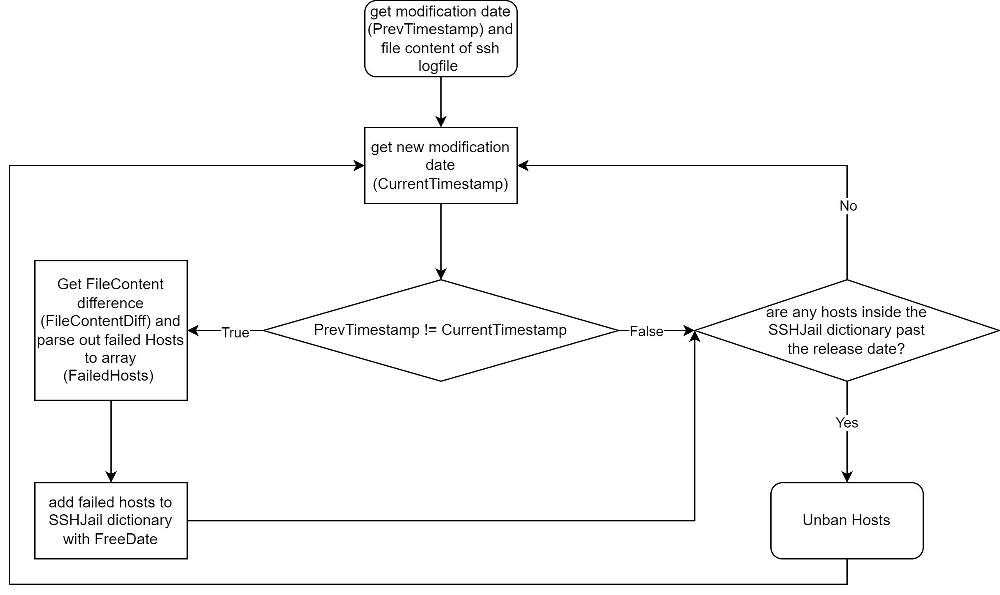

# Fail2Ban.py
This project is about my own implementation of a Fail2Ban (SSH) service for Windows 10+. 

## Flowchart / Functionality


# 1. Checklist / To-Do
- [x] bans IP addresses based on the amount of failed logins and timespan for a defined duration (tested)
- [x] unbans IP adresses after checking the "age" or CreationTime of the firewall rule
- [ ] runs as a windows service without any problem
- [x] add logging for script
- [x] store firewall rules and unban date to sshjail table (Fail2Ban db using sqlite3) so that the SSHJail is saved even after restarting/stopping the script/service
- [x] installer (automate the creation of service)
- [ ] full documentation for manual and automated installation/configuration with screenshots

# 2 Known bugs/errors as of right now
- Fail2Ban.py isn't able to start as a service.
    - I am currently working on fixing this issue but for now I'm prioritizing the functionality of the script overall. I will fully focus on fixing this issue after making it run as expected.

- Fail2Ban.py stops after banning the first IP-address.
    - This probably occurs because I have been trying to save the FreeDate (which is a datetime) and save it to an xml file without converting it to a string beforehand. I am currently working on this error.

# 3 Dependencies
- python (of course)
- Module: asyncio (used for asynchronous functions)
- Module: re (used for splitting an array into fields)
- Module: difflib (used for getting the difference between the previous and the current sshlogs)
- Module: datetime (self explanatory)
- Module: wget
- Commandline tool: [NSSM - the Non-Sucking Service manager](https://nssm.cc/download) (used for creating a service for our python script)

## sshd_config
In order to have the sshd.log file the service needs you have to configure sshd. In the future this job will be done via the installer but for now we'll have to configure it manually. Go to ```%programdata%\ssh``` and open the ```sshd_config``` file. Now change the Logging part to this:
```
# Logging
SyslogFacility LOCAL0
LogLevel Debug3
```
Now save and restart the OpenSSH Server with the following PowerShell command:
```
net stop sshd
net start sshd
```

# 4 Documentation
## functions
### GetFailedHosts
The GetFailedHosts from [Fail2Ban.py](./src/Fail2Ban.py) returns all the FailedHosts inside the FailedLines and stores them inside of an array.
```python:
def GetFailedHosts(FailedLines: list, MaxLogonAttemps: int) -> dict:
    FailedHosts = []                            # array in which FailedHosts (IP) are stored
    for line in FailedLines:
        fields = line.split(" ")                # splits line into fields at " "
        FailedHosts.append(fields[-4])          # parses out IP from sshd.log file

    FailedHosts_counts = {}                     # dictionary for storing amount of times these hosts have failed
    for FailedHost in set(FailedHosts):
        count = FailedHosts.count(FailedHost)   # counts amount of times the IP occurs inside the FailedHosts array
        FailedHosts_counts[FailedHost] = count  # stores amount of times per IP to dictionary

    for Host, count in FailedHosts_counts.items():
        if count < MaxLogonAttemps:                         # if amount of failed logins is smaller than MaxLogonAttempts-times then..
            FailedHosts = RemoveItem(FailedHosts, Host)     # remove it from FailedHosts array

    FailedHosts = RemoveDuplicates(FailedHosts) # remove duplicates from FailedHosts array
    return FailedHosts
```
## CheckBanAge
CheckBanAge from [Fail2Ban.py](./src/Fail2Ban.py) unbans hosts if the FreeDate (release date) is less or equal to the current date.
```python:
def CheckBanAge(dict: dict):
    for host, FreeDate in dict.items():
        if FreeDate <= GetDate():                       # compares if FreeDate of every host inside the dictionary is less or equal to current date and if true then..
            UnbannedHost = Host(host)                   # add unbanned host to Host class and..
            UnbannedHost.UnbanIP()                      # unban the host
            RemoveFromSQL(conn, host, str(dict[host]))  # remove host from sql table
            del dict[host]                              # delete host from table
            logging.debug(f"{host} unbanned and removed from sshjail")
```
## TableToDict
TableToDict from [Fail2Ban.py](./src/DataHandling.py) imports the data of the SQL table to the SSHJail dictionary (to prevent loss banned hosts after restart of service).
```python:
def TableToDict(conn):
    cur = conn.cursor()
    rows = cur.execute(f"SELECT * FROM {TableName}")
    dict = {}
    for row in rows:
        dict[row[0]]= strptime(row[1], date_format)

    return dict
```

... documentation for all functions is coming soon ...

The main function is asynchronous and runs every ```FailedLoginTime``` seconds. While True it checks if the modification time of the ```sshd.log``` file has changed. If 
the if-statement is true then it will get the current time and save it as the new previous timestamp of modification time and get the difference of the previous file content 
and the current file content with ```FileContentDiff()```. It will store all failed hosts to the SSHJail dictionary as a key with the value of the ```FreeDate``` or "release date"/"unban date". 
After the if-statement it checks if there are any hosts which "served their sentence" and if they did then they will get unbanned with the ```CheckBanAge()``` function. 

## run python script as windows service (NSSM)
You will need to have [NSSM - the Non-Sucking Service manager](https://nssm.cc/download) installed on your system and add it to the path in order to do this. To install NSSM extract the zip-Folder and navigate to ```nssm-2.24\win64``` inside your cmd terminal. If you type ```dir``` you should see a ```nssm.exe```. Now enter the following command:
```
nssm install "Fail2Ban.py" "<PATH TO>\python.exe" "<PATH TO>\Fail2Ban.py\src\Fail2Ban.py"
```
The output should say ```Service "Fail2Ban.py" installed successfully!``` if there is not a service called "Fail2Ban.py". Now you can open Services,  right-click "Fail2Ban.py" and start the service.

You can also get a status, start, stop, remove and restart services with the following commands:
```
# get status
nssm status <servicename>

# start service
nssm start <servicename>

# stop service
nssm stop <servicename>

# remove service
nssm remove <servicename>

# restart service
nssm restart <servicename>
```

## automated installation with [installer.py](installer.py)
If you don't want to install everything by hand then feel free to use the installer. Before you run the installer please make sure to change the ```mainpath``` variable to your repository path. The installer will install [NSSM - the Non-Sucking Service manager](https://nssm.cc/download) and create a service called "Fail2Ban.py".