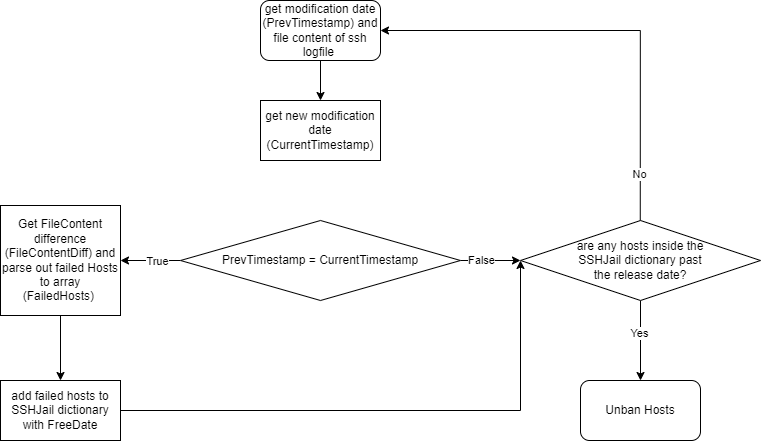

# Fail2Ban.py
This project is about my own implementation of a Fail2Ban (SSH) service for Windows 10+. 

## Flowchart / Functionality


# 1. Checklist / To-Do
- [x] it bans IP addresses based on the amount of failed logins and timespan for a defined duration (tested)
- [x] it unbans IP adresses after checking the "age" or CreationTime of the firewall rule
- [x] it runs as a windows service
- [x] add logging for script
- [ ] store firewall rules and unban date to registry or xml file so that the SSHJail is saved even after restarting/stopping the script/service
- [x] installer (automate the creation of service)

# 2 Known bugs as of right now
- None

# 3 Dependencies
- Module: asyncio (used for asynchronous functions)
- Module: re (used for splitting an array into fields)
- Module: difflib (used for getting the difference between the previous and the current sshlogs)
- Module: datetime (self explanatory)
- Module: wget
- Commandline tool: [NSSM - the Non-Sucking Service manager](https://nssm.cc/download) (used for creating a service for our python script)

# 4 Documentation
## constants
```python:
SSHLOGS = "C:/ProgramData/ssh/logs/sshd.log"
FailedLoginLimit = 3
FailedLoginTime = 60        # seconds
BanDuration = 90            # seconds
```
- SSHLOGS: Defines the path to the sshd.log file.
- FailedLoginLimit: Defines the max amount of login tries a host has
- FailedLoginTime: Defines the time period in which the max failed login tries have to occur (the main() function also runs in this frequency)
- BanDuration: Defines the duration of the ban

## main()
```python:
async def main():
    PrevTimestamp = path.getmtime(SSHLOGS)
    PrevFileContent = ReadFile(SSHLOGS)

    SSHJail = {}        # IP, FreeDate

    while True:
        await asyncio.sleep(FailedLoginTime)
        CurrentTimestamp = path.getmtime(SSHLOGS)

        if CurrentTimestamp != PrevTimestamp:
            PrevTimestamp = CurrentTimestamp

            CurrentFileContent = ReadFile(SSHLOGS)
            FileContentDiff = GetContentDiff(PrevFileContent, CurrentFileContent, SSHLOGS)
            PrevFileContent = CurrentFileContent

            FailedLines = GetFailedLines(FileContentDiff, "Failed password for")

            FailedHosts = GetFailedHosts(FailedLines, FailedLoginLimit)


            for host in FailedHosts:
                BannedHost = Host(host)
                BannedHost.BanIP()
                SSHJail[host] = GetFreeDate(BanDuration)

        CheckBanAge(SSHJail)

if __name__ == "__main__":
    asyncio.run(main())
```
The main function is asynchronous and runs every ```FailedLoginTime``` seconds. While True it checks if the modification time of the ```sshd.log``` file has changed. If 
the if-statement is true then it will get the current time and save it as the new previous timestamp of modification time and get the difference of the previous file content 
and the current file content with ```FileContentDiff()```. It will store all failed hosts to the SSHJail dictionary as a key with the value of the ```FreeDate``` or "release date"/"unban date". 
After the if-statement it checks if there are any hosts which "served their sentence" and if they did then they will get unbanned with the ```CheckBanAge()``` function. 

## run python script as windows service (NSSM)
You will need to have [NSSM - the Non-Sucking Service manager](https://nssm.cc/download) installed on your system and add it to the path in order to do this. To install NSSM extract the zip-Folder and navigate to ```nssm-2.24\win64``` inside your cmd terminal. If you type ```dir``` you should see a ```nssm.exe```. Now enter the following command:
```
nssm install "Fail2Ban.py" "<PATH TO>\python.exe" "<PATH TO>\Fail2Ban.py\src\Fail2Ban.py"
```
The output should say ```Service "Fail2Ban.py" installed successfully!``` if there is not a service called Fail2Ban. Now you can open Services,  right-click "Fail2Ban.py" and start the service.

You can also get a status, start, stop, remove and restart services with the following commands:
```
# get status
nssm status <servicename>

# start service
nssm start <servicename>

# stop service
nssm stop <servicename>

# remove service
nssm remove <servicename>

# restart service
nssm restart <servicename>
```

## automated installation with [installer.py](installer.py)
If you don't want to install everything by hand then feel free to use the installer. Before you run the installer please make sure to change the ```mainpath``` variable to your repository path. The installer will install [NSSM - the Non-Sucking Service manager](https://nssm.cc/download) and create a service called "Fail2Ban.py".